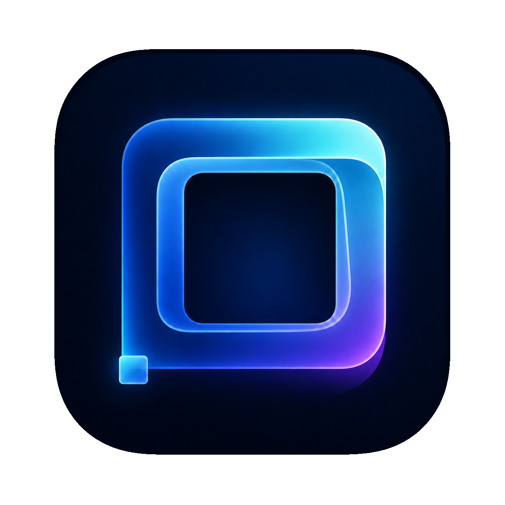

<p align="center">
  
</p>

<h1 align="center">SteadyFrame</h1>

<p align="center">
  Keep your MacBook Pro's ProMotion in a steadier high-refresh-rate state, aiming to reduce visible flicker in low-brightness gray scenes.
</p>

<p align="center">
  <strong>English</strong> · <a href="README.zh-CN.md">简体中文</a>
</p>

<p align="center">
  <a href="https://github.com/Nonex111/SteadyFrame/releases/latest/download/SteadyFrame.zip"><strong>⬇ Download SteadyFrame for macOS</strong></a>
</p>

<p align="center">
  
  
</p>

SteadyFrame is a small macOS menu bar utility for MacBook Pro displays with ProMotion. It continuously presents a nearly invisible 1 × 1-point Metal surface, asking the display pipeline to maintain a steady 60 or 120 fps presentation cadence during otherwise static content.

This may reduce the visible flicker and discomfort that some users notice in dark gray areas at low brightness.

The interface supports **Follow System**, **English**, and **Simplified Chinese** language options directly from the menu bar. The preview download is ad-hoc signed and not notarized, so macOS may require approval in **System Settings → Privacy & Security** on first launch.

> [!IMPORTANT]
> SteadyFrame requests a presentation cadence. It does not change the macOS display mode, measure the panel's physical refresh rate, or guarantee a 120 Hz lock. Results vary by Mac, macOS version, content, power state, and viewer.

## Highlights

- Request a steady 60 or 120 fps cadence while keeping ProMotion enabled.
- Run continuously or only when connected to external power.
- Stop automatically below a configurable battery level.
- Target the built-in display or all connected displays.
- Use a fixed, tiny 8/255 frame-to-frame luminance delta.
- Place the signal at the lower-left, lower-right, or center of the screen.
- Switch between Follow System, English, and Simplified Chinese from the menu bar.
- Toggle instantly with `⌃⌥⌘H` and copy runtime diagnostics from the menu bar.

## Requirements

- macOS 13 or later
- A MacBook Pro with ProMotion for the intended use case
- A Swift 5.10-compatible toolchain and macOS SDK when building from source

## Build from source

To build the app yourself:

```bash
swift test
./scripts/build-app.sh
open dist/SteadyFrame.app
```

SteadyFrame runs only in the menu bar. On first launch it is enabled at 120 fps, targets the built-in display, places the signal at the center, and runs only on external power with a 20% low-battery cutoff.
